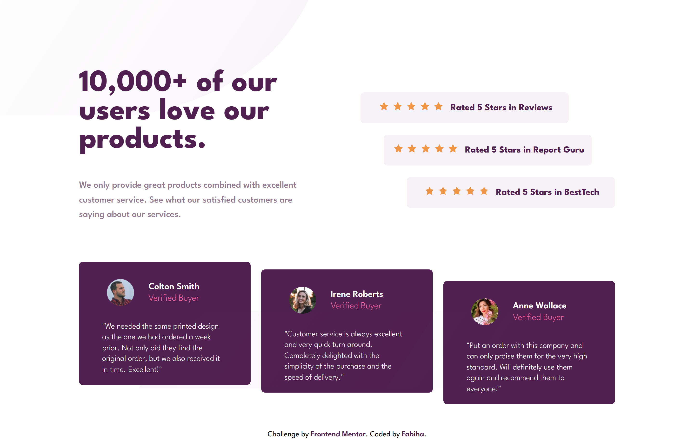

Frontend Mentor - Social proof section solution
This is a solution to the Social proof section challenge on Frontend Mentor. Frontend Mentor challenges help you improve your coding skills by building realistic projects.

📑 Table of contents

📋 Overview

📸 Screenshot

🔗 Links

🛠️ My process

🧱 Built with

🎯 What I learned

🔄 Continued development

📚 Useful resources

👩‍💻 Author

🙏 Acknowledgments

📋 Overview

This is a responsive social proof section that highlights user reviews and ratings. It was built to match the design provided by Frontend Mentor and adapts well across various screen sizes using a mobile-first approach.

📸 Screenshot

Desktop View:

🔗 Links

🔧 Solution URL: GitHub Repo
🌐 Live Site URL: Live Page

🛠️ My process

I structured the layout using Flexbox, adjusted alignment using container padding, and added background patterns with responsive sizing. My focus was on reducing position usage to avoid alignment issues and maintain a cleaner, more consistent flow across viewports.

🧱 Built with

Semantic HTML5 markup

CSS custom properties

Flexbox

Media queries

Mobile-first workflow

🎯 What I learned

I reinforced my understanding of:

Responsive layouts using Flexbox and container paddings

Controlling spacing without overusing position

Improving design consistency across screen widths

Handling alignment issues on screens with less height or unusual aspect ratios

🔄 Continued development

I want to continue improving:

Better grid layout structure for future components

Mastering spacing techniques without relying on absolute positioning

Enhancing responsiveness for unusual screen dimensions

📚 Useful resources

MDN Web Docs – Great reference for all CSS properties

CSS Tricks – Helped with layout and flexbox behavior

👩‍💻 Author

Name: Fabiha
Frontend Mentor: @Fabiha517
GitHub: Fabiha517

